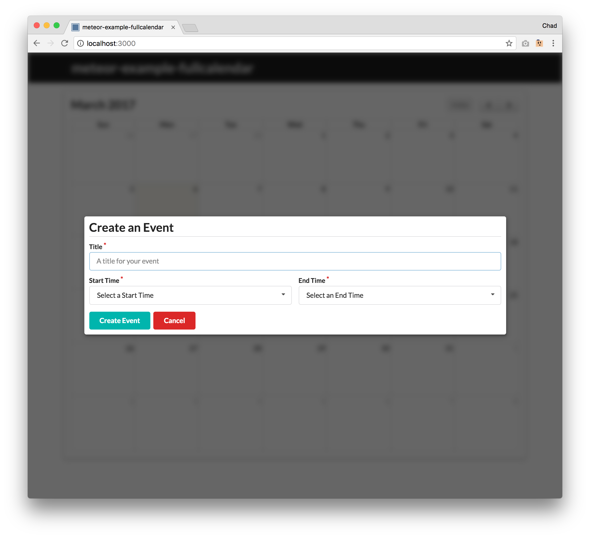
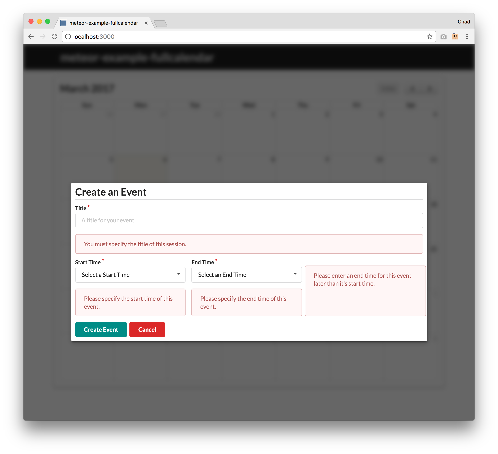
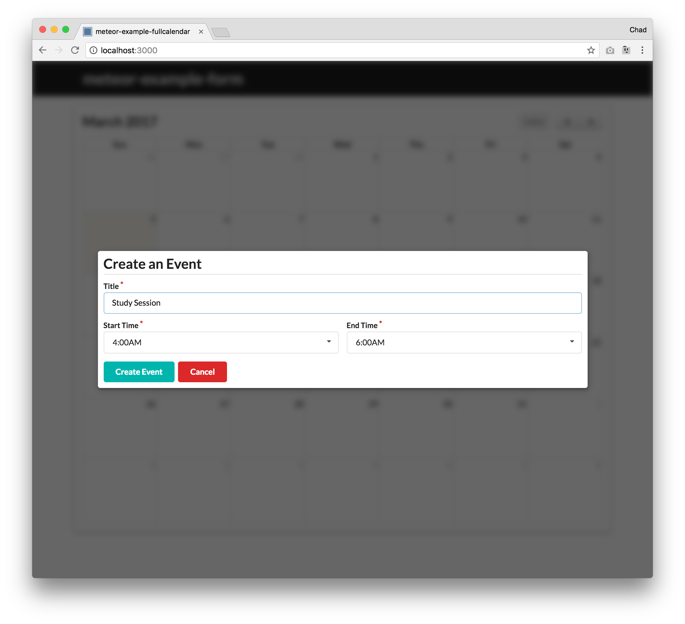
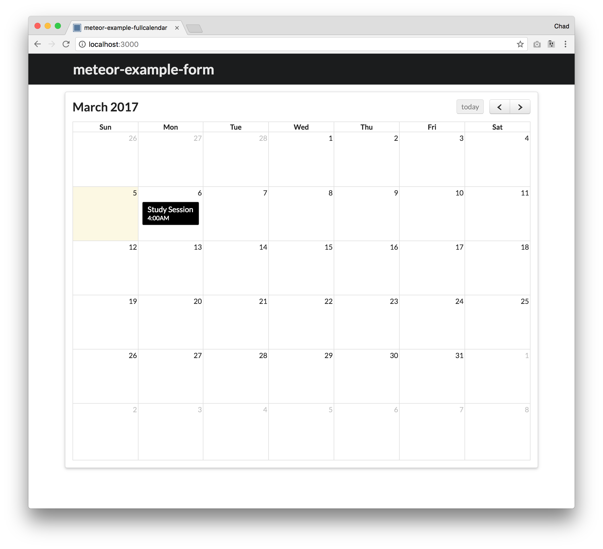
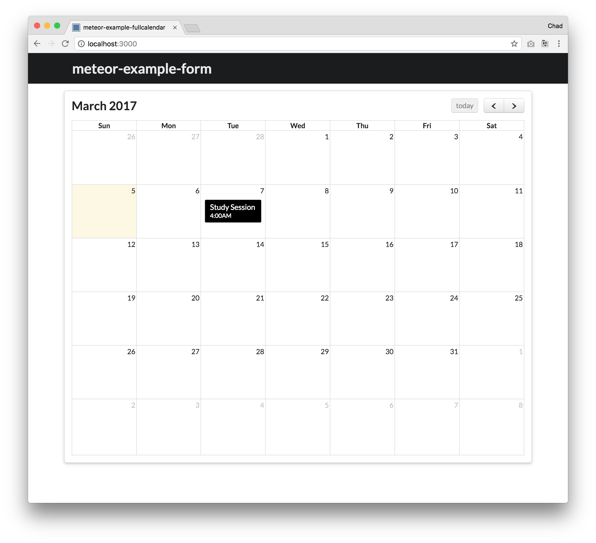
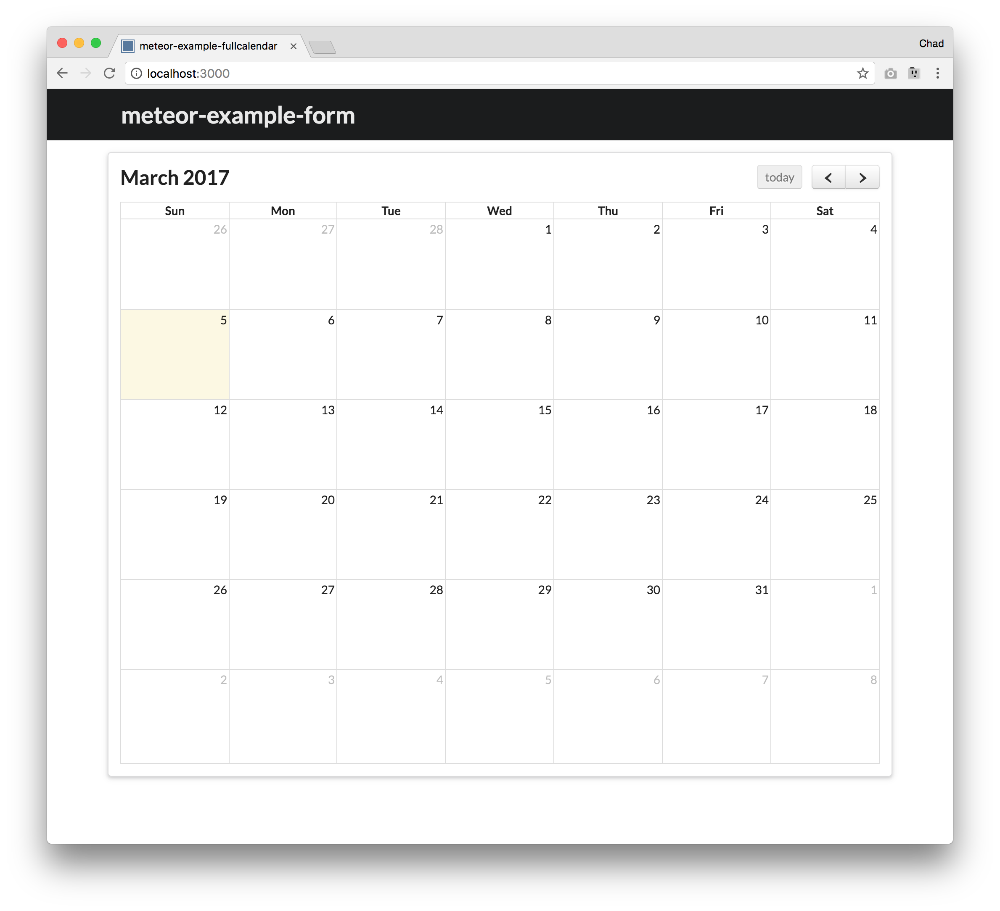

<!--Adapted from meteor-example-form index.md https://github.com/ics-software-engineering/meteor-example-form/blob/master/index.md-->

This sample application illustrates how to implement a reactive calendar with [Meteor 1.4](https://www.meteor.com/), [FullCalendar](https://fullcalendar.io/), [BlazeJS](http://blazejs.org/), and [Semantic UI](http://semantic-ui.com/). This involves:

* Displaying a calendar using the [Meteor fullcalendar package](https://atmospherejs.com/fullcalendar/fullcalendar).
* Displaying forms using the [Semantic UI form classes](http://semantic-ui.com/collections/form.html).
* Displaying modals rendered from a BlazeJS template using the [Semantic UI modal classes](http://semantic-ui.com/modules/modal.html).
* Validating form data upon submission using [Meteor Simple Schema](https://github.com/aldeed/meteor-simple-schema).
* Conditional display of page content using Reactive Dictionaries.
* Inserting new documents into a MongoDB collection.

## Installation
 
After [installing Meteor](https://www.meteor.com/install) and downloading this package, cd into the app directory and run:

```
meteor npm install
```

Start the application using:

```
meteor npm run start
```

That will invoke the script in the [package.json](https://github.com/chadmorita/meteor-example-fullcalendar/blob/master/app/package.json) to run meteor. To speed up the process, the script disables release checking.

**Note regarding bcrypt warning.** You will get the following message when you run this application:

```
Note: you are using a pure-JavaScript implementation of bcrypt.
While this implementation will work correctly, it is known to be
approximately three times slower than the native implementation.
In order to use the native implementation instead, run

  meteor npm install --save bcrypt

in the root directory of your application.
```

On some operating systems (particularly Windows), installing bcrypt is much more difficult than implied by the above message. Bcrypt is only used in Meteor for password checking, so the performance implications are negligible until your site has very high traffic. You can safely ignore this warning without any problems.

You can also run ESLint over the source code with:

```
meteor npm run lint
```

## Prerequisites

To best understand this application, it is useful to first familiarize yourself with:

* [Meteor Application Template](http://ics-software-engineering.github.io/meteor-application-template/). This sample application illustrates conventions for directory layout, naming conventions, routing, integration of Semantic UI, and coding standards. Meteor-example-form is based on this template, so we won't discuss any of these issues here.

* [Blaze Templates](http://blazejs.org/guide/spacebars.html). Read this documentation to learn about HTML spacebars and the various Javascript utilities (helpers, onCreated, onRendered, etc.).
 
* [Semantic UI Forms](http://semantic-ui.com/collections/form.html). Read this documentation to learn the CSS classes defined by Semantic UI to create nicely styled forms.

* [Semantic UI Modals](http://semantic-ui.com/modules/modal.html). Read this documentation to learn the CSS classes defined by Semantic UI to create modals.

* [Validating data with Simple Schema](https://github.com/aldeed/meteor-simple-schema#validating-data). Actually, you'll probably need to familiarize yourself with all of Simple Schema, but the section on data validation is crucial to understanding this sample application.

* [Reactive Dict, Reactive Vars, and Session Variables](https://themeteorchef.com/snippets/reactive-dict-reactive-vars-and-session-variables/).  This application uses Reactive Dictionaries. I found this blog posting to be a very concise and useful explanation of them and how they relate to other mechanisms like Session variables.

* [FullCalendar](https://fullcalendar.io/docs/). Read this documentation to learn about using FullCalendar. Note: This example uses FullCalendar version 2. You may also be interested in looking at the [Meteor FullCalendar package](https://atmospherejs.com/fullcalendar/fullcalendar).

## UI Walkthrough

The homepage of the application displays a calendar page.


The left and right arrows can be used to change the month that is display and the today button will reset the calendar to the current day. Clicking on any day on or after the current day will trigger a Semantic UI Modal to appear, which is used to create an event.



Clicking on the Create Event button without first filling out the form will cause error messages to be displayed. All events must have a title, start time, and end time. The start time must be before the end time.



Once valid information is entered into the form, you can press Create Event to insert a new event into the `EventData` collection.



After clicking on Create Event, the modal will close and a new event with the information you entered will be displayed on the calendar with its title and start time.



Events can be moved to different days by dragging and dropping them. You cannot move an event to a day that has already passed.



Clicking on an event will delete it.



## Code Walkthrough